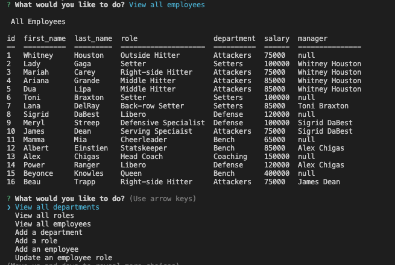

# Employee-Tracker
> This application helps to organize and plan a business!

## Table of contents
* [General info](#general-info)
* [Screenshots](#screenshots)
* [Video Walkthrough](#video_walkthrough)
* [Licenses](#licenses)
* [Code](#code)
* [Setup](#setup)
* [Inspiration](#inspiration)
* [Contact](#contact)

## General info
The user can add, view, and modify department, role, and employee data. The user can select these options from a menu. The user will be led through prompts that help to add, view, or modify the business data.

## Screenshots

## Video Walkthrough 
[Employee Tracker Walkthrough](https://damp-bastion-26381.herokuapp.com)

## Setup
* Clone GitHub repository 
* run npm install
* run npm i inquirer
* run npm i console.table
* run npm i mysql2

Run 'npm start' to enter the application.

## Code
* JavaScript
* Node.js
* mySQL

* inquirer - question and menu prompts to help the user navigate
* console.table - dispalys SQL data in a table form
* mysql2 - connects to database and allows for application structure

## Licenses
* MIT license
* ISC

## Inspiration
UCLA week 12 Challenge. 

## Contact
Application created by Alex Chigas. 
